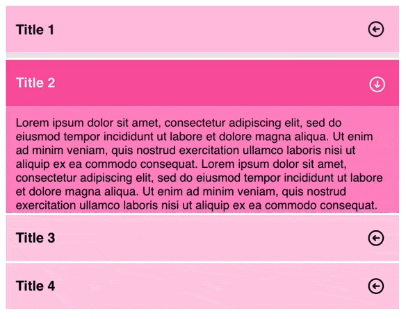

# Formación react-spring + extras

## Introducción

El objetivo es tocar un poco de `react-spring` y paralelamente utilizar la api de alto nivel de 
react (`React.Children`, `React.CloneElement`), la notación de puntos, algunas funciones de
`react-use` y poco más.

## Pasos

1. Crear proyecto, limpiar un poco y dejarlo listo para empezar.
2. Crear los componentes (`components/Accordion/*`).
3. Importar y usar los componentes en `App`.
4. Incluir CSS.
5. Heredar y usar los métodos de `Accordion` primero en `Item` y luego en `Header` e `Index`.
6. Filtrar tipos de componentes en `Accordion` y `Body` (opcional).
7. Funcionalidad `useKey` (opcional).

## Resultado

